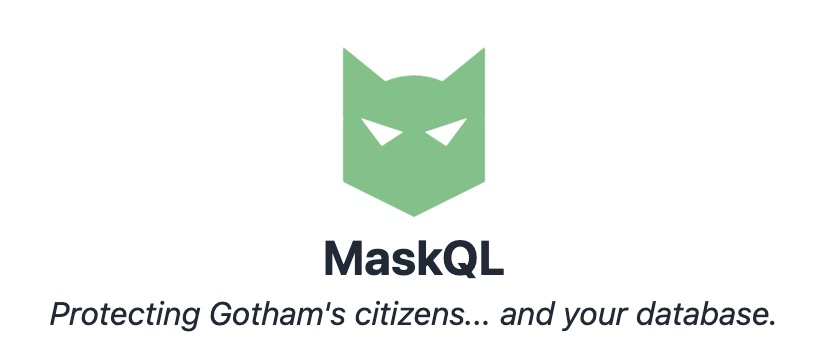
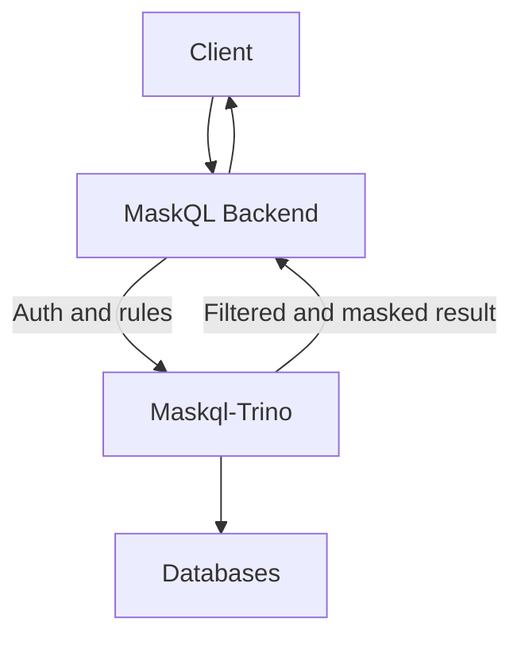

<div align="center">
  
</div>

# MaskQL
**Protecting Gotham's citizens... and your database.**

MaskQL is an open-source middleware, built on top of [Trino](https://trino.io), that applies masking, filtering, and transformation rules on the fly, without changing the source databases. It is designed for sensitive environments (healthcare, finance, etc.) where some columns must be pseudonymized, encrypted, or transformed before they are exposed.

This is especially useful when you can read a database but cannot change it, and when making a masked replica is not possible or not desired.

---

## Features

* Connect to multiple databases: PostgreSQL, MySQL, ClickHouse, and more.
* Column masking with SQL expressions, for example: `regexp_replace(email, '(.+)@(.+)', '***@$2')`.
* Table filtering with a SQL WHERE clause.
* Advanced transformations:

  * extract text from binary PDF files,
  * pseudonymize unstructured text using Named Entity Recognition (NER).
  * Encrypt any column & preserve typing
* Per-user access control with allow, deny, and inheritance.
* Admin UI (Vue 3) to manage users, catalogs, and rules.
* Export and import rules as JSON by user and catalog.
* All-in-one Docker Compose deployment with Traefik as reverse proxy.

---

## For users

If you only want to run MaskQL, use the published Docker images.
You do not need to clone the repository, set `HF_TOKEN`, or build anything locally.

The smallest deployment bundle is in `install/`:

1. Create a working directory on your server.
2. Copy `install/compose.yml`, `install/.env`, and `install/tls.yml` into it.
3. Edit `.env` with your host, admin credentials, and secrets.
4. Edit `tls.yml` with the paths to your TLS certificate and key.
5. Start the stack:

```bash
docker compose up -d
```

MaskQL should be available within a few minutes at the HTTPS address defined by `MASKQL_HOST` and `MASKQL_PORT`.

If you already cloned the repository, you can follow the same approach with the root `compose.yml`, `.env.example` (renamed to `.env`), and `tls.yml`.

---

## For contributors

Use the repository root and the development stack from `compose.dev.yml`.
See `CONTRIBUTING.md` for contribution notes and `docs/QUICKSTART.md` for a short local walkthrough.

### Requirements

* [Docker](https://docs.docker.com/get-docker/)
* `make` (GNU Make)
* [uv](https://docs.astral.sh/uv/) to run the Python test suite
* `HF_TOKEN` only if you rebuild the `trino` image locally

### Start the development stack

Copy the example environment file, build the Trino plugin once, then start the dev profile:

```bash
cp .env.example .env
bash ./scripts/build-trino-plugin.sh
make local
```

This starts the full development stack with Docker Compose.
On a fresh clone, the extra build step is needed because `compose.dev.yml` mounts the plugin jars from the local workspace.

### Rebuild services locally

Use these targets only when you need to rebuild images from source:

```bash
make local-build
make rebuild-backend
make rebuild-frontend
make rebuild-trino
```

`HF_TOKEN` is only required for `trino` rebuilds because the Docker build downloads the Hugging Face model used by the pseudonymization pipeline.

### Stop and clean

```bash
make down
```

---

## Environment Variables  

Here is the list of environment variables you can configure in the `.env` file:  

- **POSTGRES_USER**: Username for the PostgreSQL connection  
- **POSTGRES_PASSWORD**: Password for the PostgreSQL connection  
- **MASKQL_HOST**: Hostname used by MaskQL (without port). This variable is required for TLS.  
- **MASKQL_PORT**: Port used by MaskQL  
- **MASKQL_ADMIN_USER**: Administrator username for MaskQL configuration  
- **MASKQL_ADMIN_PASSWORD**: Administrator password for MaskQL configuration  
- **MASKQL_JWT_SECRET**: Secret key used by MaskQL to secure JWT tokens  
- **MASKQL_ENCRYPT_PASSWORD**: Secret key used by MaskQL to encrypt data on the fly  
- **MASKQL_TRINO_SHARED_SECRET**: Shared secret used by Trino to communicate with the components  

> You can generate secrets with `openssl rand -hex 16` or `openssl rand -hex 8`.

---

## Create a self-signed certificate for testing

```bash
openssl req -x509 -newkey rsa:4096 -keyout key.pem -out cert.pem -sha256 -days 3650 -nodes -subj "/C=FR/ST=Grand-Est/L=Reims/O=CHU de Reims/OU=Institut de l'Intelligence Artificielle en Santé/CN=maskql" -addext "subjectAltName=DNS:localhost"
```
DNS must match the MaskQL host.

---

## Project structure

```
.
├── Makefile          # Targets: local, local-build, down, clean, logs, ps
├── compose.yml       # Docker stack (Traefik, Backend, Trino, PostgreSQL, Frontend)
├── trino/            # Trino custom code (UDF, access control)
├── maskql/           # Backend (FastAPI): users, catalogs, rules, auth
├── frontend/         # Admin UI (Vue 3)
├── tests/            # Python tests (unittest)
├── docs/             # Documentation (work in progress)
├── certs/            # Certificates used by MaskQL
└── tox.ini           # Test configuration
```

---

## Components

* **MaskQL Backend**: FastAPI service. Manages users, catalogs, and rules. Handles auth and coordinates access through Trino.
* **Frontend**: Vue 3 admin UI to create users and catalogs, and to configure rules.
* **Custom Trino**: data gateway to the databases. Applies functions and access control.
* **PostgreSQL**: stores users, catalogs, and rules.
* **Traefik**: reverse proxy and entry point to the stack.

---

## Tests

Run tests with [tox](https://tox.wiki/) using `uv`:

```bash
uv run tox
```

This will:

1. Start the stack (`make local`)
2. Health check
3. Run `unittest` tests
4. Stop and clean the stack (`make down`)

---

## How it works



1. The client sends a query to the MaskQL backend.
2. The backend checks auth and fetches the rules for the current user and target catalog.
3. Trino runs the query and applies filters, masking, and transformations.
4. The backend returns a result that already respects the rules.

---

## Rule model and inheritance

Each rule targets a user and a catalog. A rule can apply at different levels:

| Level  | schema\_name | table\_name | column\_name | effect usage           |
| ------ | ------------ | ----------- | ------------ | ---------------------- |
| DB     | ""           | ""          | ""           | not used               |
| Schema | X            | ""          | ""           | not used               |
| Table  | X            | Y           | ""           | used as WHERE filter   |
| Column | X            | Y           | Z            | used as SQL expression |

* `allow: true` allows the target and all its children, unless there is a local deny.
* `allow: false` denies the target and all its children, unless there is a local allow.
* If there is no local rule, the status is inherited from the parent.

Examples:

* Table filter: `effect = "is_active = TRUE AND region = 'EU'"`.
* Column transform: `effect = "price * 1.2"` or `"COALESCE(email, 'hidden')"`.
* Default deny on a whole schema: set a deny rule at schema level, then allow specific tables or columns.

The backend enforces a unique constraint on `(user_id, catalog_id, schema_name, table_name, column_name)`.

---

## Admin UI

* Login for admins
* Catalogs: create, edit, delete
* Users: create, edit, delete, and a manage permissions
* Permissions: four panels (Database, Schemas, Tables, Columns) to define rules
  * Also export and import JSON for the current user and the selected catalog

### Export and import format

Export produces a file like this:

```json
{
  "version": 1,
  "user_id": 123,
  "catalog_id": 7,
  "exported_at": "2025-09-02T10:00:00Z",
  "rules": [
    { "schema_name": "public", "table_name": "", "column_name": "", "allow": true, "effect": "" },
    { "schema_name": "public", "table_name": "orders", "column_name": "", "allow": true, "effect": "is_active = TRUE" },
    { "schema_name": "public", "table_name": "orders", "column_name": "price", "allow": true, "effect": "price * 1.2" }
  ]
}
```

On import, the UI ignores any `id`, `user_id`, and `catalog_id` inside the file. The rules are applied as upserts for the current user and the currently selected catalog.

---

## Authentication

Admin endpoints:

* `POST /admin/login` (Basic auth, server-side session)
* `POST /admin/logout`
* `GET /admin/health` (guard for protected routes)

The frontend redirects to `/login` if not authenticated.

---

## Support and maintenance

Please use the repository issue tracker for:

* bug reports,
* installation and local setup problems,
* documentation gaps,
* feature requests,
* usage questions about catalogs, rules, and MaskQL SQL access.

If you are working from a mirror of the repository, please use the issue tracker on that mirror.
When you open an issue, a small reproducer helps a lot. Please also redact credentials, patient data, and other sensitive information.

I maintain MaskQL on a best-effort basis.
I can usually help with reproducible bugs, setup problems, documentation gaps, and small focused contributions, but I do not offer a guaranteed response time.

Out of scope:

* emergency or on-call production support,
* private consulting or custom integration work,
* review of confidential datasets or credentials,
* legal, regulatory, or compliance advice,
* guaranteed compatibility with every third-party database, connector, or deployment setup.

See `CONTRIBUTING.md` for the contribution workflow and issue reporting details.

---

## Configuration

See `compose.dev.yml` and `.env.example` for defaults values.
