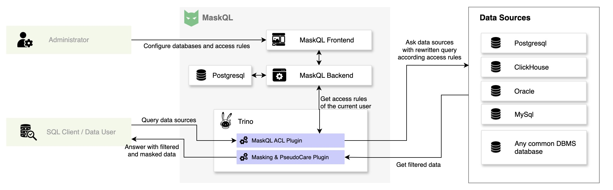

# Summary

Clinical research increasingly depends on timely access to routine care data, especially in multicenter settings where institutions want to contribute data without giving up local control over disclosure. Yet hospital data teams still face an awkward trade-off: researchers and analysts want direct SQL access to operational databases, while the institutions hosting those databases need fine-grained control over what each user is allowed to see. In practice, this usually leads either to a separate masked copy of the data, which is expensive to maintain and quickly becomes outdated, or to custom access-control logic written inside each downstream application. *MaskQL* is an open-source middleware that addresses this gap by sitting between end users and one or more source databases and applying protection rules at query time. Built on top of Trino, it exposes live databases through a familiar SQL interface while enforcing per-user permissions, row-level filters, column-level transformations, encryption, and pseudonymization of unstructured clinical text and text extracted from PDF documents [@trino2022]. For text pseudonymization, the current implementation uses EDS-Pseudo through the PseudoCare Python package [@edspseudo2024; @pseudocare2025]. This makes it possible to support research access to routine care data without exposing the source systems directly: users query data as if they were talking to the original database, but the returned result already complies with local governance rules.

# Statement of need

We developed *MaskQL* for a very practical problem that appears repeatedly in hospital data projects. Source systems can often be queried, but they cannot be modified. At the same time, local institutions are understandably reluctant to provide unrestricted access to operational databases or to maintain a full de-identified replica for every research use case. The difficulty becomes even sharper in multicenter settings, where a central research infrastructure needs access to several sites, but each site wants to keep control over what may leave its own database.

This is not only a database-permission problem. In clinical systems, identifying information appears in several forms: directly in relational columns, indirectly in linked tables, and frequently in free-text reports or scanned documents. A governance layer that only hides a few columns is therefore not enough. Earlier work on privacy-aware data management and fine-grained access control showed that disclosure constraints can be enforced by interposing policy logic between users and databases, often through query rewriting or authorization views [@hippocratic2002; @rizvi2004; @qapla2017]. In parallel, clinical de-identification research has shown that free text requires dedicated NLP methods and that pseudonymization often needs to preserve readability and internal consistency rather than simply remove tokens [@neamatullah2008; @philter2020; @edspseudo2024].

*MaskQL* was designed to bridge these two lines of work in an operational setting. Administrators define per-user rules on schemas, tables, and columns. Table-level rules act as row filters, while column-level rules act as transformations or masking expressions. Those rules are then applied transparently when a query is executed, without changing the source database and without requiring the user to learn a new query language. The main audience is therefore not only software developers, but also hospital IT teams, data managers, and clinical data warehouse engineers who need auditable access rules around live sensitive data.

This need is already concrete in our own setting. *MaskQL* is used in HD4C (Health Data for Care), a France 2030 supported multicenter health data warehouse project led by CHU de Reims and involving partner healthcare institutions across France [@hd4c2023]. In this project, *MaskQL* is used so that a central data infrastructure can connect directly to partner databases while each institution retains full control over the data it allows to leave its own system.

# State of the field

The software landscape around *MaskQL* is real, but fragmented. On the database side, systems such as Hippocratic Databases, Qapla, and more recent work on disclosure-compliant query answering show that privacy and access-control rules can be enforced at query time rather than after export [@hippocratic2002; @qapla2017; @mascara2024]. These works are conceptually close to the relational core of *MaskQL*. In particular, Mascara is an important reference because it treats masking as part of query answering rather than as a one-off preprocessing step [@mascara2024].

A second family of tools focuses on anonymization and pseudonymization of released datasets. ARX is a well-established open-source framework for anonymizing structured data under explicit disclosure-risk models, and CRATE is a mature open-source platform for clinical text extraction, anonymization, and research database workflows [@arx2020; @crate2017]. These tools solve important problems, but they address a different operational moment: preparing or transforming data for release, rather than mediating direct SQL access to live heterogeneous sources.

A third family focuses on clinical text de-identification. Philter and EDS-Pseudo are strong examples of systems designed to detect and protect sensitive entities in clinical notes [@philter2020; @edspseudo2024]. They are highly relevant to one part of our problem, but they are not meant to be complete SQL gateways with per-user runtime governance over schemas, tables, rows, and columns.

This split in the landscape is the main reason we built *MaskQL* as a separate software package instead of extending a single existing tool. We did not need a better NER model than EDS-Pseudo, nor a stronger tabular anonymization workbench than ARX. We needed a deployable middleware that could combine query-time relational governance with protection of unstructured clinical content, while fitting the realities of federated hospital data access. In that sense, *MaskQL* is best seen as an integration contribution: it brings together SQL mediation, hierarchical access rules, and clinical pseudonymization in one operational gateway.

# Software design

We chose a middleware architecture for two reasons. First, the source databases that matter in practice are often outside the control of the research team. Second, SQL is still the common language used by analysts, engineers, and many scientific applications. Trino provides the federation layer that makes heterogeneous catalogs look like one queryable space, while *MaskQL* adds governance, authentication, and policy management around that layer [@trino2022]. Figure 1 summarizes the main components of this architecture and the way requests flow through the system.

Concretely, the software combines a FastAPI back end, a PostgreSQL metadata store, a Vue-based administration interface, and a Trino-based query gateway exposed over HTTPS. Administrators register source catalogs and define rules for users. The rule model follows the way people naturally think about access: database, schema, table, and column. Rules can explicitly allow or deny access, and child objects inherit from their parent unless a more specific rule overrides that behavior. At query time, table-level rules become row filters and column-level rules become SQL expressions. The repository quickstart illustrates this with a small example in which the filter `email like 'a%'` removes one row and the transformation `encrypt(name)` masks the `name` column while leaving the rest of the query unchanged.

A second design choice was to treat structured and unstructured content together. In hospital databases, the most sensitive information is often not limited to classic identifier columns. It also appears in letters, reports, and binary PDF documents stored in the database. *MaskQL* therefore includes transformations that can extract text from PDF content and pseudonymize text with EDS-Pseudo [@edspseudo2024]. In practice, *MaskQL* uses EDS-Pseudo through the PseudoCare Python package [@pseudocare2025]. This is useful not only because it detects sensitive entities, but also because it replaces them with plausible fictitious surrogates. That strengthens pseudonymization while preserving the readability and clinical relevance of the document, and makes the pipeline easier to expose as a runtime transformation inside Trino. This choice matters for real deployments because it avoids forcing institutions to maintain one governance mechanism for SQL tables and a completely separate one for textual documents.

These choices come with trade-offs. Query-time protection is attractive because it avoids synchronizing masked replicas and keeps the governance decision close to the source data, but it also puts pressure on transparency and predictability. For that reason, we favored explicit rule effects expressed as filters or SQL transformations over a more opaque policy language.

# Research impact statement

The most important evidence for *MaskQL* is that it is already used in an active multicenter data infrastructure project rather than existing only as a repository prototype. In HD4C, a central platform needs to access data from partner institutions while leaving disclosure decisions under local institutional control. This is exactly the setting that motivated *MaskQL*, and it gives the software a concrete research and operational role inside a French hospital data warehouse initiative supported through the national EDS funding program [@hd4c2023]. This kind of deployment matters more for our use case than a synthetic benchmark alone, because the hard part is not only transforming data correctly, but also fitting the governance workflows of several institutions, while adapting to different DBMSs and heterogeneous data schemas.

MaskQL matured through sustained operational use in a hospital data-sharing setting before being prepared for public release, documentation, and external reuse. As part of this release process, we documented installation and contribution workflows, added automated checks on GitHub Actions, and prepared a quickstart that reproduces a masked query end to end on a seeded PostgreSQL dataset. Users can evaluate MaskQL directly from published Docker images, while contributors can rebuild the Trino plugin and run the automated test suite from source.

# AI usage disclosure

Generative AI tools were used to improve English phrasing in parts of this manuscript and the project documentation. All suggested changes were reviewed and edited by the authors. The authors remain fully responsible for all submitted materials.

# Acknowledgements

The authors thanks the HD4C partners and the hospital data-governance stakeholders whose constraints and feedback shaped the design of *MaskQL*. The authoss also thanks colleagues at IIAS and CHU de Reims for helpful feedback on the software and manuscript. *MaskQL* also builds on several open-source projects, especially Trino, EDS-Pseudo, and PseudoCare.

# References
